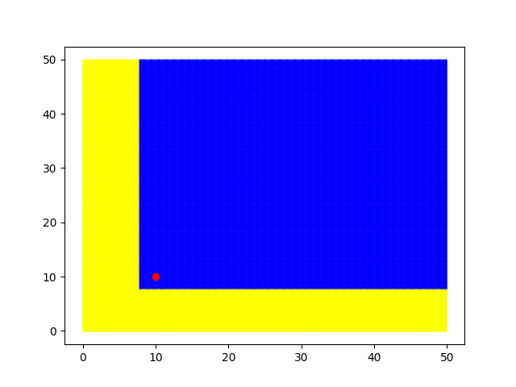

# boa-transformation-vis
Visualizador de cambios en la relación de dominación para un par de costos debido a una transformación

### ⚠️ Código desorganizado ⚠️

## Instrucciones
Cambiar variables al inicio del archivo main.py para determinar parámetros de la visualización.
- **X, Y**: Coordenadas del punto base con el cual se comparan los otros puntos
- **RANGE_X, RANGE_Y**: Rango en ejes X e Y de la visualización. Ambos rangos comienzan en 0.
- **PRECISION**: Cuantos puntos se simulan por eje en cada intervalo [i, i+1).
- **DEPTH**: Profundidad de búsqueda binaria en modo _border_
- **t**: Nombre de la transformación a usar.
- **args**: Diccionario de argumentos para la función a usar.
- **t2, args2**: Nombre y diccionarios para la segunda transformación en modo **compare**.

Al ejecutar el código, por defecto se utilizará el modo **full** y no se guardará la visualización, a excepción de que se incluya un nombre para guardar el archivo. Se puede especificar el modo de visualización de la siguiente manera:
```python main.py [mode] [filename] ```

Actualmente se tienen los siguientes modos:
- **full**: Visualización completa de todos los puntos en el rectángulo definido por los rangos, según la precisión.
- **border**: Solamente se visualiza el borde entre los puntos dominados y los no dominados.
- **compare**: Visualización de dos transformaciones distintas en un gráfico para comparar.

Ejemplos de uso:
- ```python main.py```: Se visualiza la transformación definida según **t, args** en modo **full**.
- ```python main.py border```: Se visualiza la transformación definida en modo **border**.
- ```python main.py compare cmp.png```: Se guarda la visualización de las dos transformaciones definidas en el archivo `cmp.png`.

## Imágenes de ejemplo

Para todos los ejemplos se utiliza **X** = **Y** = 10, **RANGE_X** = **RANGE_Y** = 50, **PRECISION** = 10

### Sin transformación


### Alfa-beta (alfa = beta = 0.8)


### Alfa-r (alfa = 0.8, r = 0.5)


### Alfa-seno (alfa = 0.8)


### Poda epsilon (epsilon = 0.3)


### Poda epsilon-consistente (epsilon = 0.3)


### Modo **border** con alfa-r (alfa = 0.8, r = 0.5, depth = 100)


### Modo **compare** con alfa-beta (alfa = beta = 0.8) y alfa-seno (alfa = 0.8)
